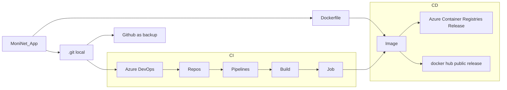

### MoniNet application

Here is an application that retrieves an host's IP address and set machine on port 3000. 
The graph illustrating the CI/CD process of the MoniNet application is presented below:\

