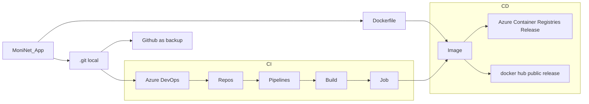

## MoniNet application

Here is an application that retrieves an host's IP address and set machine on port 3000. 
The graph illustrating the CI/CD process of the MoniNet application is presented below:



### Creating IaC:

1. I built a new local git repository by `git init` command in required folder.
2. I compose a `Dockerfile` where I set a few commands. This file copy folder `moninet` to the container, execute update OS, install nodejs, npm, check these version, and finally run Moninet application.
3. I made `build.sh` that indicate `moninet:1.0` image and run this application.

### CI process:

1. In Azure Devops I constructed a new project `Moninet`.
2. On Repos I checked if everything is fine.
3. In Pipeline I set up a work-flow to execute job. `azure-pipelines.yml` had been automatically created in YAML to start job. 
4. Job is still working correctly with status `running`.
5. Every time I have made change in code: `moninet.js`  or `Dockerfile` on local host I did command:

```
git status && git add -A && git commit -m "changeX" && git push
```

​      and on the job screen I saw this change almost immediately.

### CD process #1 (ACR):

1. I created `docker image` using `Dockerfile`, then build a container.

2. On Azure Portal, login to the Azure Containers Registry and upload build release with `1.0` version:

   ```
   docker login owmap1.azurecr.io
   docker tag moninet:1.0 owmap1.azurecr.io/moninet:1.0
   docker push owmap1.azurecr.io/moninet:1.0
   ```

3. JSON file as a prove:

   ``` 
   {
       "sku": {
           "name": "Basic",
           "tier": "Basic"
       },
       "type": "Microsoft.ContainerRegistry/registries",
       "id": "/subscriptions/xxx/Microsoft.ContainerRegistry/registries/owmap1",
       "name": "owmap1",
       "location": "eastus",
       "tags": {
           "exam task": "1.0"
       },
       "properties": {
           "loginServer": "owmap1.azurecr.io",
           "creationDate": "2023-05-17T11:49:36.8162066Z",
           "provisioningState": "Succeeded",
           "adminUserEnabled": true,
           "policies": {
               "quarantinePolicy": {
                   "status": "disabled"
               },
               "trustPolicy": {
                   "type": "Notary",
                   "status": "disabled"
               },
               "retentionPolicy": {
                   "days": 7,
                   "lastUpdatedTime": "2023-05-17T11:49:43.7486413+00:00",
                   "status": "disabled"
               }
           }
       }
   }
   ```

### CD process #2 (docker hub):

1. I used similar command like before:

   ```
   docker login
   docker build -t danielzdun/moninet:1.0 .
   docker push danielzdun/moninet:1.0
   ```

   That uploading this release with `1.0` version on [hub.docker.com](https://hub.docker.com/) 

   
